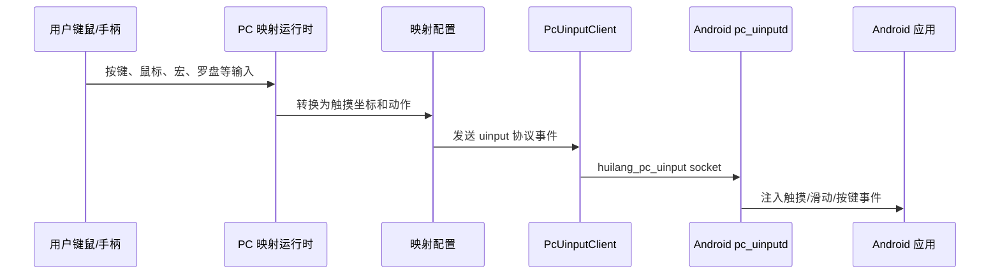

# 架构说明

灰狼投屏的核心目标不是传统意义上的“低码率视频投屏”，而是“极低延迟的交互式安卓画面镜像”。项目用更高带宽换取更短链路，主画面链路采用 JPEG 帧直传，避开常规视频编码流中难以完全消除的编码器队列、GOP、解码重排和播放同步缓冲。

## 核心思路

传统投屏通常把屏幕当作视频流处理：

```text
采集 -> 视频编码器 -> 网络传输 -> 视频解码器 -> 播放同步 -> 显示
```

这条路线能显著降低带宽，但常会带来固定管线延迟。即使 Android 设备的 GPU、硬件编码器性能很强，视频编码器和解码器仍可能引入缓冲、同步和重排成本。

灰狼的主链路选择另一条路线：

```text
采集 -> JPEG 单帧编码 -> 立即发送 -> 单帧解码 -> 最新帧显示
```

每一帧都是独立图像，不依赖前后帧。PC 端以“最新帧优先”为原则，尽量避免堆积历史帧，因此更适合游戏映射、实时控制、桌面交互等对响应时间极敏感的场景。

为了避免全屏高质量 JPEG 带来的带宽压力，项目支持 ROI 区域策略：中心区域保持高质量画面，用于保证游戏准星、角色、主要操作区域的清晰度；中心之外的区域可以降低 JPEG 质量或缩放编码，用较少数据保留环境感知，从而降低传输带宽和排队延迟。

作者本地实测参考：1080P、Snapdragon 8 Elite、JPEG、144 FPS 场景下，端到端延迟可到 2ms 以内。这个结果依赖高性能 Android 设备、稳定散热、USB 3.0 及以上链路，以及未被系统温控明显降频的运行状态。实际结果会受到 SoC 性能、温度墙、USB/网络链路、PC 解码性能、显示器刷新率和测量方法影响。

## 设备与散热要求

灰狼的极低延迟模式本质上是用设备算力、内存带宽和传输带宽换响应速度，因此更适合高性能 Android 设备，例如 Snapdragon 8 Elite 级别或同等级旗舰 SoC。低端设备也可以运行，但在高分辨率、高质量、高 FPS 参数下，可能出现编码耗时上升、帧率下降或延迟波动。

为了稳定复现极低延迟，需要注意：

- Android 设备应保持良好散热，建议避免长时间裸机高温运行。
- 系统温控不能已经明显限制 CPU/GPU/内存性能，否则 JPEG 编码、ImageReader 回调和 socket 写入都会变慢。
- 高帧率测试前应观察设备是否进入降频状态；温度上升后，同一参数下的延迟和帧率可能明显变化。
- 推荐使用 USB 3.0 及以上的数据线、接口和设备链路。USB 2.0 有效带宽较低，在 1080P、高 FPS、较高 JPEG 质量下容易成为瓶颈。
- 如果使用局域网链路，应使用高质量、低抖动网络，避免链路抖动掩盖编码链路本身的性能。
- PC 端也需要足够的 CPU/GPU 解码和渲染能力，尤其是 1080P、144 FPS 或更高参数。

## ROI 带宽优化

低延迟 JPEG 投屏的主要代价是带宽。灰狼通过 ROI 区域策略降低这个代价：

- 中心区域保持高质量，优先保证玩家最关注的画面区域。
- 外围区域降低质量或按比例缩放，减少单帧数据量。
- 分块编码可以让中心和外围采用不同参数，也方便多核并行处理。
- PC 端显示时仍然合成为完整画面，用户看到的是完整投屏，不是单独裁剪的小窗口。

这套策略让项目在保持中心区域观感的同时，减少 USB/网络传输压力，也减少大帧在 socket 和解码阶段排队造成的延迟波动。

## 总体结构

```mermaid
flowchart LR
    subgraph Android["Android 端"]
        MP["MediaProjection"]
        VD["VirtualDisplay"]
        IR["ImageReader RGBA"]
        CC["CenterScreenCaptureController"]
        NJ["NativeCenterCropJpegEncoder<br/>TurboJPEG / 分块编码 / 直接写 fd"]
        JS["JpegFrameSender<br/>LocalSocket: huilang_screen_mirror"]
        CV["CenterRoiVideoStreamSender<br/>可选 ROI H.264 辅助链路"]
        AU["AudioPlaybackCaptureSender<br/>可选音频链路"]
        CO["PcScreenMirrorCoordinator<br/>启动、配置、控制命令"]
    end

    subgraph Bridge["ADB / Socket 转发"]
        P1["27183: JPEG 主画面"]
        P2["27184: 音频"]
        P3["27185: ROI 视频"]
    end

    subgraph PC["Windows PC 端"]
        MN["mirror_net<br/>ADB 转发与 socket 配置"]
        MR["mirror_receiver<br/>接收 JPEG / 解析 FrameHeader"]
        DP["SplitDecodePool / TurboJPEG<br/>并行解码"]
        SS["SharedState<br/>最新帧与性能数据"]
        DR["D3D11Renderer<br/>上传纹理 / 显示 / HUD"]
        MO["映射编辑与运行时<br/>按键、罗盘、锁定、菜单、宏"]
        UC["PcUinputClient"]
    end

    subgraph AndroidInput["Android 输入注入"]
        UD["pc_uinputd<br/>huilang_pc_uinput"]
        UI["uinput / 触摸事件"]
    end

    MP --> VD --> IR --> CC --> NJ --> JS --> P1 --> MN --> MR --> DP --> SS --> DR
    IR --> CV --> P3 --> MN
    CC --> AU --> P2 --> MN
    CO --> CC
    DR --> MO --> UC --> UD --> UI
    MN -.反向控制命令.-> JS
```



## 主画面链路

1. PC 端通过 ADB 建立端口转发，把 Windows TCP 端口连接到 Android 的 LocalSocket。
2. Android 端 `PcScreenMirrorCoordinator` 启动投屏流程，创建 `JpegFrameSender`，等待 PC 连接 `huilang_screen_mirror`。
3. `CenterScreenCaptureController` 申请 `MediaProjection`，用 `VirtualDisplay` 把屏幕输出到 `ImageReader`。
4. `ImageReader` 产出的 RGBA buffer 进入 native 编码路径。`NativeCenterCropJpegEncoder` 通过 JNI 调用 `huilang_native_encoder` 和 `turbojpeg`。
5. native 层直接从 `ImageReader` 的 direct buffer 读取像素，可按全屏、中心裁剪、分块等模式编码 JPEG。
6. 编码完成后，native 层直接写入 `LocalSocket` 的 file descriptor，减少 Kotlin/Java 层 ByteArray 中转。
7. PC 端 `mirror_receiver` 读取 `FrameHeader` 和 JPEG 数据，按分块情况并行解码为 BGRA。
8. 解码后的最新帧写入 `SharedState`，`D3D11Renderer` 取最新帧上传纹理并显示。

主链路协议头定义在 `PC/mirror_types.h`：

```cpp
struct FrameHeader {
    int32_t magic;
    int32_t version;
    int32_t width;
    int32_t height;
    int32_t jpegSize;
    int64_t frameProducedNs;
    int64_t callbackStartNs;
    int64_t encodeStartNs;
    int64_t encodeEndNs;
    int64_t sendStartNs;
    int64_t sendStartWallMs;
};
```

这些时间戳用于 HUD 和性能分析，可以拆分采集、回调、编码、发送、PC 解码和显示阶段。

## 为什么延迟低

- JPEG 是逐帧独立编码，没有 GOP、B 帧、参考帧和解码重排。
- native 层直接写 socket fd，减少 Java/Kotlin 层复制和调度。
- 支持分块编码和分块解码，利用多核并行缩短单帧处理时间。
- PC 端采用最新帧优先策略，避免网络或解码抖动时排队播放旧帧。
- D3D11 负责显示路径，PC 端可以把解码结果快速上传到 GPU 纹理。
- 控制命令复用反向通道动态调整参数，不需要频繁重启投屏链路。
- HUD 和性能统计持续暴露采集、编码、socket、解码、显示等阶段耗时，方便针对设备调参。

代价也很明确：JPEG 帧直传会消耗更高带宽，尤其在高分辨率、高帧率、高质量参数下。因此它更适合 USB 3.0 及以上、低抖动局域网，或对延迟优先级高于带宽的场景。

## 映射输入链路

投屏只是第一层，项目还包含 PC 到 Android 的映射输入系统：



PC 端映射模块主要包括：

- `pc_mapping_profile.*`：映射配置模型和保存加载。
- `pc_mapping_overlay.*`：映射控件显示、编辑和命中检测。
- `pc_mapping_runtime.*`：普通按键触摸运行时。
- `pc_compass_runtime.*`：罗盘/摇杆类移动控制。
- `pc_lock_runtime.*`：锁定滑动、持续触摸等控制。
- `pc_menu_runtime.*`：菜单、轮盘、物品栏类交互。
- `pc_macro_runtime.*`：宏动作编排。
- `pc_uinput_client.*`：把 PC 端映射结果发送给 Android 注入端。
- `pc_uinputd.cpp`：Android 侧输入注入守护进程源码。

这部分让项目不只是“看见手机画面”，而是能在 PC 上进行低延迟交互控制。

## 可选辅助链路

代码中还保留了带宽优化或特殊场景使用的辅助链路：

- `CenterRoiVideoStreamSender`：Android 端中心 ROI H.264 辅助视频链路。
- `center_video_receiver.*`：PC 端 ROI 视频接收和解码。
- `AudioPlaybackCaptureSender` / `audio_receiver.*`：Android 音频捕获与 PC 播放。

这些链路可以在需要降低局部带宽、叠加中心区域或传输音频时使用。项目的极低延迟主卖点仍然是 JPEG 主画面链路。

## 运行时配置

PC 可以通过控制命令动态调整 Android 端参数，典型命令包括：

- `HLJPGSUB`：切换 JPEG 采样模式，例如 4:2:0 或 4:4:4。
- `HLJPGQ`：调整 JPEG 质量。
- `HLFPS`：调整目标 FPS。
- `HLPRESET`：切换全屏分辨率预设。
- `HLSPLIT`：调整全屏/裁剪模式的分块数量。

这些命令通过已连接的 socket 反向发送到 Android，`PcScreenMirrorCoordinator` 接收后更新 `CenterScreenCaptureController` 和 native 编码参数。

## 模块分层

```text
Android App
  ScreenMirrorService
  MainActivity
  PcScreenMirrorCoordinator
  CenterScreenCaptureController
  JpegFrameSender
  NativeCenterCropJpegEncoder
  CenterRoiVideoStreamSender
  AudioPlaybackCaptureSender

Android Native
  native_center_crop_jpeg.cpp/.h
  libturbojpeg.so
  libhuilang_native_encoder.so

PC Receiver / Renderer
  mirror_net.*
  mirror_receiver.*
  center_video_receiver.*
  audio_receiver.*
  d3d11_*.cpp
  mirror_types.h

PC Mapping
  pc_mapping_*.*
  pc_compass_*.*
  pc_lock_*.*
  pc_menu_*.*
  pc_macro_*.*
  pc_uinput_client.*

Android Input Daemon
  pc_uinputd.cpp
  pc_uinput_protocol.h
```

## 开源仓库说明

为了避免仓库过大，FFmpeg、libjpeg-turbo、Android `.so`、Windows `.dll/.exe`、签名文件和编译产物没有提交到 Git。需要恢复完整本地构建环境时，请参考 [THIRD_PARTY_DEPENDENCIES.md](THIRD_PARTY_DEPENDENCIES.md)。
